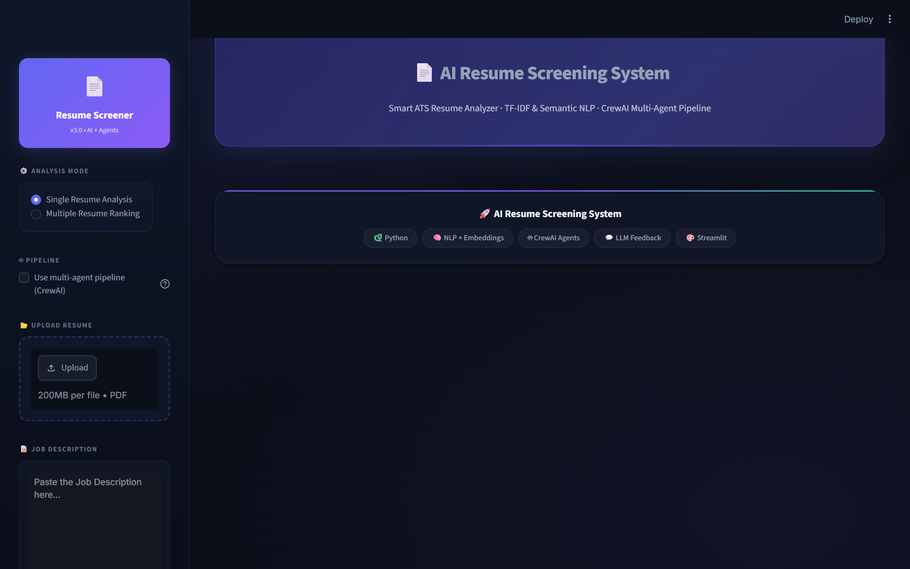
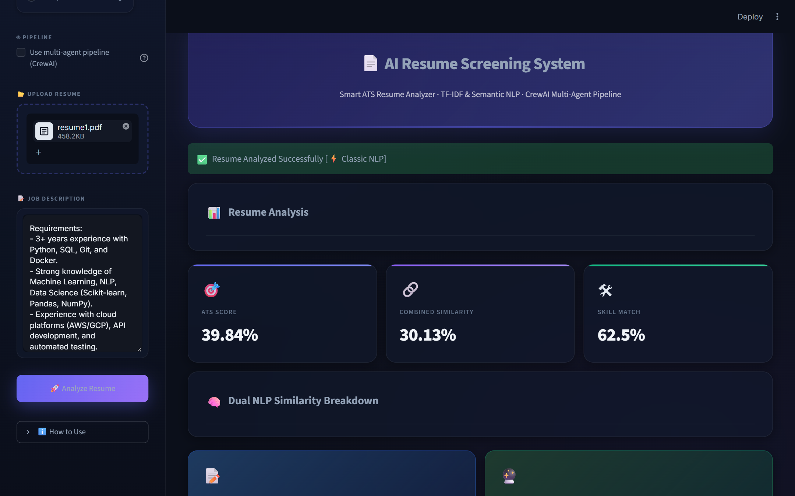
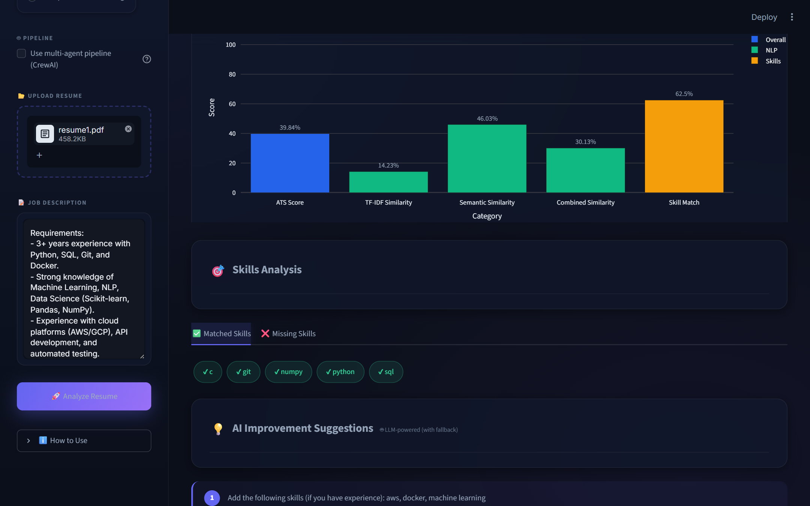
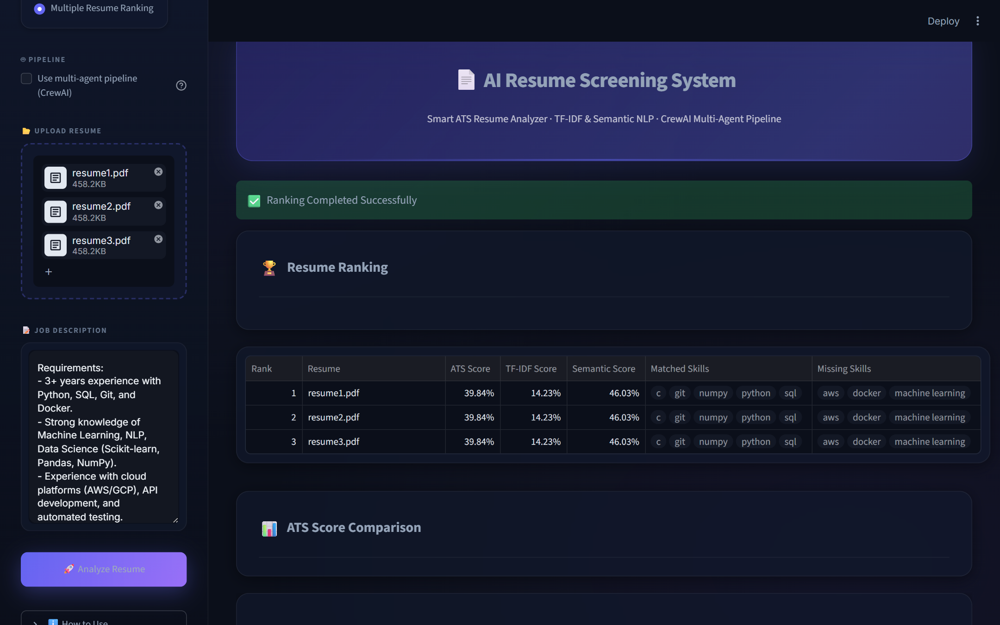
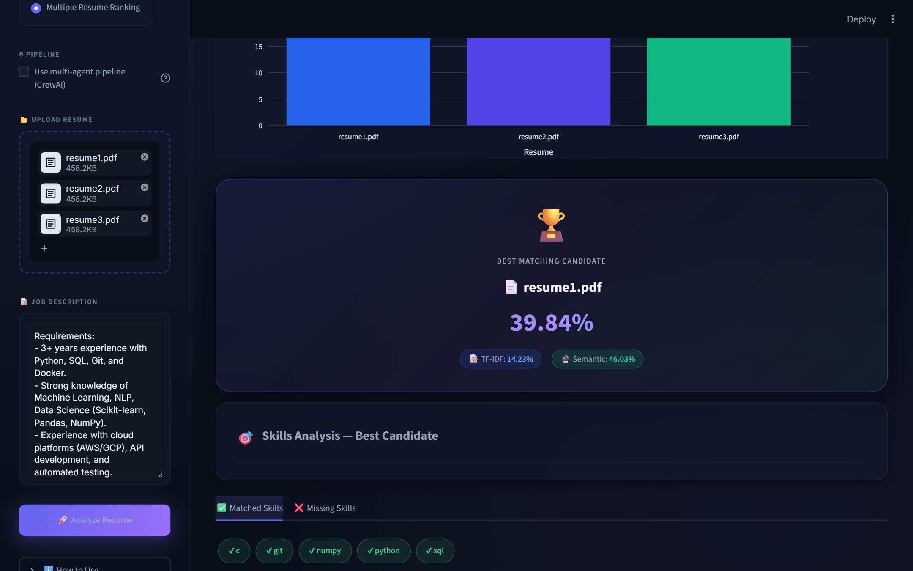

# 🤖 AI Resume Screening System

### Intelligent ATS-Based Resume Analyzer & Candidate Ranking Platform


[](https://ankush-resume-screening.streamlit.app)

---
### 📌 ATS Scoring • Resume Ranking • Skill Matching • AI Suggestions

> An AI-powered Resume Screening System that analyzes resumes against
> job descriptions, calculates ATS compatibility scores, ranks
> candidates, identifies missing skills, and generates personalized
> improvement suggestions.


------------------------------------------------------------------------

# 📖 Overview

The **AI Resume Screening System** is an AI-powered recruitment
assistant that automates resume evaluation using ATS-inspired scoring
techniques.

The application extracts resume content from PDF files, compares it with
a given Job Description, calculates ATS compatibility scores, identifies
matched and missing skills, ranks multiple candidates, and generates
personalized suggestions to improve resume quality.

With interactive visualizations and automated candidate ranking, the
system enables recruiters to efficiently shortlist the most suitable
candidates while helping job seekers optimize their resumes.

------------------------------------------------------------------------

# ✨ Features

### 📄 Single Resume Analysis

-   ATS Compatibility Score (weighted blend of similarity + skill match)
-   **Dual NLP Scoring** — TF-IDF keyword similarity + Semantic sentence-embedding similarity shown side by side
-   Resume Parsing (PDF via pdfplumber)
-   Job Description Matching
-   Skill Extraction & Missing Skill Identification
-   **LLM-Powered AI Suggestions** (OpenAI / Anthropic / Gemini) with rule-based fallback

### 🏆 Multiple Resume Ranking

-   Upload Multiple Resumes
-   Automatic Candidate Ranking with TF-IDF, Semantic, and ATS Score per resume
-   ATS Score Comparison Chart
-   Best Candidate Identification with score breakdown
-   Recruiter-Friendly Candidate Comparison Table

### 📊 Interactive Dashboard

-   Score Overview bar chart (ATS, TF-IDF, Semantic, Combined, Skill Match)
-   Resume Comparison Charts
-   Interactive Plotly Graphs
-   Downloadable PDF Report

### 🤖 AI-Powered Evaluation

-   Optional **CrewAI Multi-Agent Pipeline** (3 sequential agents: Extraction → Matching → Feedback)
-   TF-IDF keyword overlap scoring
-   Semantic similarity via `all-MiniLM-L6-v2` sentence embeddings
-   Skill Gap Analysis
-   Actionable Resume Recommendations (LLM or rule-based)

------------------------------------------------------------------------

# 🖼️ Screenshots

## 🏠 Home Page



## 📄 Resume Analysis



## 🎯 Skills & AI Suggestions



## 🏆 Multiple Resume Ranking



## 👑 Best Candidate Selection



------------------------------------------------------------------------

# ⚙️ Tech Stack

| Category | Technologies |
|---|---|
| Language | Python |
| Framework | Streamlit |
| Data Analysis | Pandas, NumPy |
| Machine Learning | Scikit-learn, Sentence-Transformers |
| NLP / Embeddings | TF-IDF (Scikit-learn), all-MiniLM-L6-v2 |
| Agent Framework | CrewAI (optional, with lightweight fallback) |
| LLM Suggestions | OpenAI / Anthropic / Gemini (optional) |
| Visualization | Plotly |
| PDF Processing | pdfplumber |
| Styling | HTML, CSS (dark glassmorphism theme) |
| Version Control | Git, GitHub |

------------------------------------------------------------------------

# 🧠 Workflow

``` text
Resume Upload (PDF)
      │
      ▼
PDF Text Extraction (pdfplumber)
      │
      ▼
Preprocessing + Skill Extraction
      │
      ├──────────────────────────────┐
      ▼                              ▼
TF-IDF Similarity          Semantic Similarity
(keyword vectors)          (MiniLM embeddings)
      │                              │
      └──────────┬───────────────────┘
                 ▼
      Combined Similarity + Skill Match
                 │
                 ▼
         ATS Score (weighted)
                 │
      ┌──────────┼──────────┐
      ▼          ▼          ▼
  Suggestions  Ranking  PDF Report
```

------------------------------------------------------------------------

# 🤖 Agentic AI Architecture

## Dual NLP Similarity

Resumes are scored against the job description using **two complementary NLP techniques** run in parallel:

| Technique | Method | Strength |
|-----------|--------|----------|
| **TF-IDF Similarity** | Keyword frequency vectors + cosine similarity | Catches exact keyword overlap |
| **Semantic Similarity** | `all-MiniLM-L6-v2` sentence embeddings + cosine similarity | Catches meaning matches even without exact keywords |

Both scores are weighted into a **Combined Similarity** score (`0.70 × semantic + 0.30 × tfidf`), then combined with Skill Match (`0.7 × similarity + 0.3 × skill_score`) to produce the final ATS score.

## 3-Agent CrewAI Pipeline

An optional multi-agent pipeline (toggle in the sidebar) orchestrates the analysis as three sequential CrewAI agents:

``` text
┌─────────────────────────┐
│   1. Extraction Agent   │  Wraps: extract_text_from_pdf() + extract_skills()
│   (PDF → Skills)        │  Output: resume text, skill list
└────────────┬────────────┘
             │ context
             ▼
┌─────────────────────────┐
│   2. Matching Agent     │  Wraps: calculate_similarity() + calculate_semantic_similarity()
│   (Scores + Gaps)       │         + calculate_skill_match()
└────────────┬────────────┘  Output: TF-IDF score, semantic score, matched/missing skills
             │ context
             ▼
┌─────────────────────────┐
│   3. Feedback Agent     │  Wraps: generate_suggestions() (LLM or rule-based fallback)
│   (Suggestions)         │  Output: personalised improvement suggestions
└─────────────────────────┘
```

**Process:** `Process.sequential` — each agent's output is passed as context to the next.

## LLM-Powered Suggestions

- Set `LLM_PROVIDER` (`openai` / `anthropic` / `gemini`) and `LLM_API_KEY` env vars to enable LLM feedback.
- The prompt returns **structured JSON** (`[{"title": ..., "detail": ...}]`) for clean rendering.
- **Fallback:** If no API key is set or the call fails, rule-based suggestions are used automatically — the app never crashes.

------------------------------------------------------------------------

# 📁 Project Structure

``` text
Resume-Screening-System/
├── agents/
│   ├── __init__.py
│   └── crew.py               # CrewAI 3-agent pipeline (with lightweight fallback)
├── assets/
│   └── style.css              # Dark glassmorphism theme
├── screenshots/
│   ├── home.png
│   ├── resume-analysis.png
│   ├── skills-suggestions.png
│   ├── resume-ranking.png
│   └── best-candidate.png
├── sample_resume/
│   └── resume1.pdf
├── tests/
│   ├── test_crew.py
│   ├── test_matching.py
│   ├── test_pdf.py
│   ├── test_preprocessing.py
│   ├── test_ranking.py
│   ├── test_semantic_similarity.py
│   ├── test_similarity.py
│   ├── test_skill_extractor.py
│   └── test_suggestions.py
├── utils/
│   ├── matching.py            # Skill match scoring
│   ├── pdf_reader.py          # PDF text extraction (pdfplumber)
│   ├── preprocessing.py       # Text cleaning & stopword removal
│   ├── ranking.py             # Multi-resume ranking
│   ├── report_generator.py    # PDF report generation (ReportLab)
│   ├── similarity.py          # TF-IDF + semantic similarity
│   ├── skill_extractor.py     # Skill identification from text
│   └── suggestions.py         # LLM / rule-based suggestions
├── analyzer.py                # Single-resume analysis orchestrator
├── app.py                     # Streamlit UI
├── requirements.txt
├── README.md
└── .gitignore
```

------------------------------------------------------------------------

# 🚀 Installation

``` bash
git clone https://github.com/AnkushSharma5/Resume-Screening-System.git
cd Resume-Screening-System
python -m venv venv
```

**Windows**

``` bash
venv\Scripts\activate
```

**Linux/macOS**

``` bash
source venv/bin/activate
```

``` bash
pip install -r requirements.txt
streamlit run app.py
```

------------------------------------------------------------------------

# 📊 Core Functionalities

-   ✅ Single Resume ATS Analysis
-   ✅ Multiple Resume Ranking (with TF-IDF & Semantic score per resume)
-   ✅ Dual NLP Similarity (TF-IDF + Semantic)
-   ✅ Job Description Matching
-   ✅ Skill Extraction & Missing Skill Detection
-   ✅ ATS Compatibility Score
-   ✅ Optional CrewAI Multi-Agent Pipeline
-   ✅ LLM-Powered Suggestions (with rule-based fallback)
-   ✅ Candidate Comparison Dashboard
-   ✅ Interactive Plotly Visualizations
-   ✅ Downloadable PDF Analysis Report
-   ✅ 38+ pytest tests

------------------------------------------------------------------------

# 🎯 Future Enhancements

-   ✅ LLM-powered Resume Feedback *(implemented)*
-   ✅ Semantic Similarity with Sentence Embeddings *(implemented)*
-   ✅ Multi-agent CrewAI Pipeline *(implemented)*
-   📄 DOCX Resume Support
-   🖼 OCR-based Resume Parsing
-   🔐 Recruiter Authentication
-   🗄 Database Integration
-   📧 Email Report Generation
-   💬 AI Interview Question Generator
-   📈 Resume Analytics Dashboard
-   🌐 Multi-language Resume Support

------------------------------------------------------------------------

# 🤝 Contributing

1.  Fork the repository.
2.  Create a feature branch.
3.  Commit your changes.
4.  Open a Pull Request.

------------------------------------------------------------------------

# 📜 License

This project is licensed under the **MIT License**.

------------------------------------------------------------------------

<div align="center">

### ⭐ If you found this project useful, consider giving it a Star!

**Made with ❤️ by Ankush Sharma**

</div>
